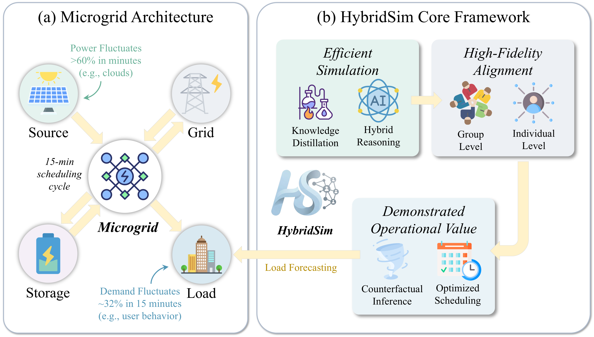

# HybridSim: A Lightweight Hybrid Framework for Microgrid Large-Scale Energy Demand Forecast and Optimized Scheduling

HybridSim is a lightweight hybrid framework for large-scale (10k-level) energy demand forecast and optimized scheduling in microgrids. By employing efficient knowledge distillation and a dynamic hybrid reasoning mechanism, the framework leverages collaborative inference between LLMs and multi-layer perceptrons (MLPs) to significantly enhance computational efficiency while preserving forecast accuracy.

The core code related to the thesis has been made open source. However, due to time constraints, some of the code is still being sorted out. All the code will be made open source as soon as possible.

## 🌟 Key Features

- **Efficient Simulation Architecture**: Combines knowledge distillation with dynamic hybrid reasoning for high-resolution energy demand forecasting
- **High-Fidelity Sim2Real Alignment**: Group-individual coordinated alignment algorithm for consistency with real-world data
- **Scalable**: Supports simulation of up to 10,000 agents simultaneously
- **Multiple Architectures**: Supports pure LLM, hybrid, pure deep learning, and rule-based approaches
- **Energy Management Optimization**: Demonstrated operational value with 44.50% reduction in operational costs

## 🏗️ Architecture Overview

HybridSim employs a three-stage approach:

1. **Knowledge Distillation**: Transfers LLM reasoning capabilities to lightweight MLPs through intention-based decision mechanisms
2. **Hybrid Reasoning**: Dynamically switches between MLPs (for normal scenarios) and LLMs (for complex/anomalous situations)
3. **Sim2Real Alignment**: Multi-level calibration ensuring both group metrics and individual behaviors align with real-world data



*Figure 1: Microgrid Architecture and HybridSim Core Framework*

## 📊 Performance Results

- **Operational Cost Reduction**: 44.50% compared to existing methods
- **Peak Grid Power Reduction**: 32.25% reduction in peak grid-purchased power
- **Token Consumption**: 87.29% reduction in token usage
- **Error Rate**: Maintains low error (MRE=0.18) across multiple scenarios
- **Cross-domain Validation**: Tested in 4 social simulation scenarios (culture, law, politics, collective action)

## 🚀 Quick Start

### Prerequisites

- Python 3.8+
- PyTorch
- vLLM framework (for LLM deployment)
- NVIDIA GPU (recommended: 4×A100-40G for full-scale deployment)

### Installation

```bash
# Clone the repository
git clone https://github.com/your-username/HybridSim.git
cd HybridSim

# Install dependencies
pip install -r requirements.txt

# Or install as a package
pip install -e .
```

### Basic Usage

```bash
# Run hybrid simulation with 100 agents
python run_simulation.py --architecture hybrid --agent-count 100

# Run with custom parameters
python run_simulation.py \
    --architecture hybrid \
    --agent-count 1000 \
    --llm-workers 30 \
    --dl-workers 5000 \
    --confidence-threshold 0.75 \
    --environmental-condition hot
```


*Figure 2: HybridSim Framework - Overall architecture showing knowledge distillation, hybrid reasoning mechanism, and Sim2Real alignment*

### Architecture Options

- `pure_llm`: Pure LLM-based simulation
- `hybrid`: Hybrid LLM-MLP approach with intention mechanism
- `hybrid_direct`: Hybrid approach with direct prediction
- `pure_dl`: Pure deep learning approach
- `pure_rule`: Rule-based simulation
- `pure_direct_dl`: Pure direct prediction model

## 📋 Parameters

| Parameter | Description | Default |
|-----------|-------------|---------|
| `--architecture` | Simulation architecture type | `hybrid` |
| `--agent-count` | Number of agents (max: 10000) | `100` |
| `--llm-workers` | LLM parallel workers | `30` |
| `--dl-workers` | Deep learning parallel workers | `5000` |
| `--confidence-threshold` | MLP confidence threshold | `0.75` |
| `--environmental-condition` | Environmental condition | `hot` |
| `--feedback` | Enable real-world alignment | `false` |
| `--feedback-iterations` | Number of feedback iterations | `1` |

## 📁 Project Structure

```
HybridSim/
├── src/                          # Core simulation modules
│   ├── hybridsim/               # Main simulation package
│   │   ├── simulator.py        # Main simulator class
│   │   ├── student_agent.py    # Student agent implementation
│   │   ├── model_router.py     # Hybrid reasoning router
│   │   ├── direct_model_router.py # Direct prediction router
│   │   ├── feedback_pipeline.py # Sim2Real alignment pipeline
│   │   ├── rule_engine.py      # Rule-based simulation engine
│   │   ├── token_usage.py      # Token usage tracking
│   │   └── ...
│   ├── dl_model/              # Trained MLP models
│   │   ├── cascade_energy_model.pth # Intention-based model
│   │   └── direct_energy_model.pth  # Direct prediction model
│   └── feedback/               # Real-world alignment data
│       ├── simulated_behavior_15min.json
│       ├── real_appliance.json
│       └── feedback_data.csv
├── data/                       # Agent profile data
│   ├── agents_100.json        # 100 agent profiles
│   └── agents_10000.json      # 10000 agent profiles
├── figure/                     # Documentation figures
│   ├── figure1.png            # Microgrid architecture diagram
│   └── figure2.png            # HybridSim framework diagram
├── run_simulation.py          # Main entry point
└── requirements.txt           # Python dependencies
```

### Data Files

The framework includes pre-configured agent profiles and feedback data:

- **Agent Profiles**: Located in `data/` directory
  - `agents_100.json`: 100 student agent profiles for small-scale simulations
  - `agents_10000.json`: 10000 student agent profiles for large-scale simulations
  
- **Feedback Data**: Located in `src/feedback/` directory
  - `simulated_behavior_15min.json`: 15-minute interval behavior simulation data
  - `real_appliance.json`: Real appliance usage data for alignment
  - `feedback_data.csv`: Feedback data for Sim2Real alignment

- **Trained Models**: Located in `src/dl_model/` directory
  - `cascade_energy_model.pth`: Intention-based cascade prediction model
  - `direct_energy_model.pth`: Direct prediction model

## 🔧 Advanced Configuration

### Feedback and Alignment

Enable real-world data alignment for improved accuracy:

```bash
python run_simulation.py \
    --architecture hybrid \
    --feedback true \
    --feedback-iterations 3
```

### Environmental Conditions

Simulate different weather scenarios:
- `hot`: Hot summer conditions
- `warm`: Mild weather
- `cool`: Cool conditions
- `cold`: Cold winter conditions
- `bad weather`: Extreme weather (typhoons, storms)

### Large-Scale Deployment

For campus-scale simulations (10,000 agents):

```bash
python run_simulation.py \
    --architecture hybrid \
    --agent-count 10000 \
    --llm-workers 50 \
    --dl-workers 10000
```

## 📈 Output and Results

The simulator provides comprehensive output including:

- **Energy Consumption Summary**: Total and per-capita consumption
- **Location-based Distribution**: Energy usage by location (dormitory, classroom, library, etc.)
- **Appliance-based Distribution**: Consumption by device type
- **Token Usage Statistics**: LLM token consumption metrics
- **Simulation Logs**: Detailed step-by-step execution logs

## 🎯 Use Cases

1. **Campus Microgrid Management**: Optimize energy scheduling for university campuses
2. **Demand Response Planning**: Predict and manage peak demand periods
3. **Renewable Integration**: Balance distributed energy resources
4. **Emergency Planning**: Simulate energy demand during extreme weather events
5. **Policy Impact Assessment**: Evaluate energy conservation measures

## 🔬 Research Applications

Beyond energy management, HybridSim demonstrates strong cross-domain transferability in:
- Cultural simulation
- Legal system modeling
- Political behavior analysis
- Collective action scenarios

## 📄 License

This project is licensed under the MIT License - see the [LICENSE](LICENSE) file for details.
